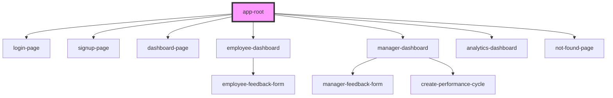

# app-root

<!-- Auto Generated Below -->

## Dependencies

### Depends on

- [login-page](../../pages/login-page)
- [signup-page](../../pages/signup-page)
- [dashboard-page](../../pages/dashboard-page)
- [employee-dashboard](../../pages/dashboard-page)
- [manager-dashboard](../../pages/dashboard-page)
- [analytics-dashboard](../../pages/dashboard-page)
- [not-found-page](../../pages/not-found-page)

### Graph

----------------------------------------------

*Built with [StencilJS](https://stenciljs.com/)*
